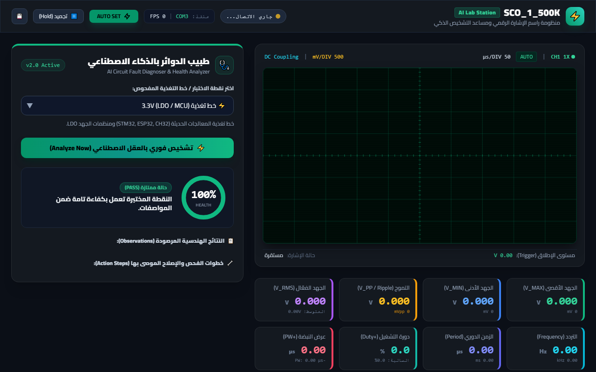
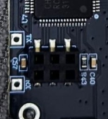
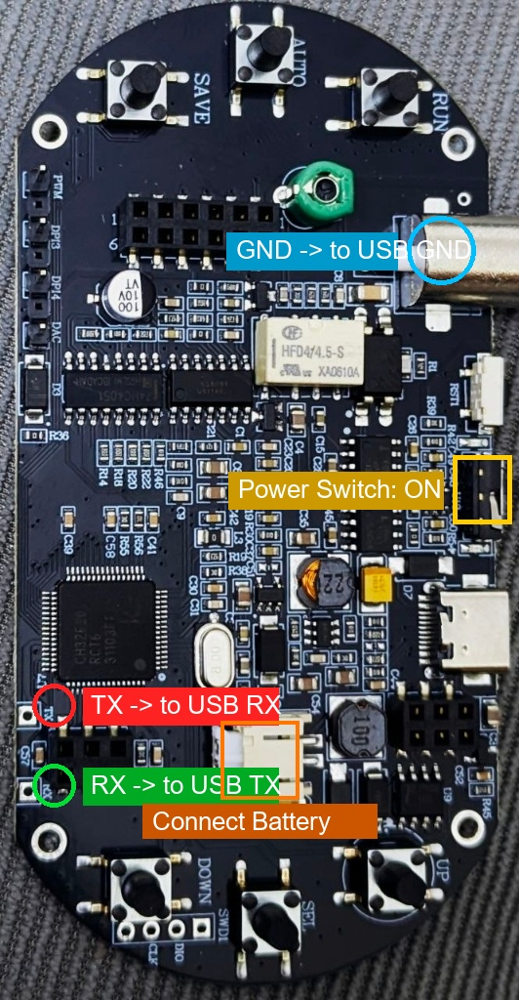
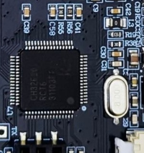
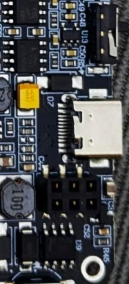

# ⚡ منظومة SCO_1_500K ومحطة الفحص الذكي (AI Lab Workstation)

[](LICENSE)
[](https://www.python.org/)
[](https://www.wch-ic.com/)
[](#عن-المشروع)

تحويل راسم الإشارة الرقمي المحمول الصيني الزهيد **SCO_1_500K** إلى **محطة فحص وتحكم مخبرية متطورة على الحاسوب**، مدعومة بمحرك ذكاء اصطناعي متخصص في تشخيص أعطال الدوائر الإلكترونية وكشف الشورت، وهبوط الجهد، وجفاف مكثفات التنعيم (High Ripple / Bad ESR)، والتحكم عن بُعد.



---

> [!NOTE]
> ### 📌 طبيعة المشروع:
> هذا **مشروع جانبي تجريبي مفتوح المصدر (Side Project / Proof of Concept)**، تم بناؤه ومشاركته لخدمة مجتمع الإلكترونيات والمهندسين والتقنيين والهواة. قد يتم العمل عليه وتطويره وتحديثه لاحقاً، والباب مفتوح بالكامل للمساهمات المجتمعية لتطويره.

---

## 🔍 قصة المشروع وخلفيته ("القضية")

جهاز **SCO_1_500K** هو راسم إشارة محمول ومولد نبضات شهير ورخيص التكلفة، يعتمد في عتاده على المتحكم الدقيق **WCH CH32F203RCT6** (معمارية ARM Cortex-M3، بتردد 144MHz وذاكرة 256KB Flash).

على الرغم من إمكانيات عتاده، فإن الكتالوج الرسمي والشركة المصنعة تنص بوضوح على:
> **`Upper computer: Not supported for now`** (برنامج الحاسوب غير مدعوم حالياً).

وعند توصيل كابل الـ Type-C بالحاسوب في الوضع العادي، لا يتعرف عليه النظام إطلاقاً ولا يصدر أي صوت؛ لأن خطوط البيانات في منفذ الـ Type-C مخصصة فقط لوضع ترقية الفيرموير (Bootloader)، بينما في وضع التشغيل العادي يعمل المنفذ فقط لتزويد البوردة بالطاقة وشحن البطارية عبر شريحة الشحن `U9`.

### ماذا كشفت الهندسة العكسية وفحص البوردة؟
1. **تحليل الفيرموير (Disassembly)**:
   عند فحص كود التحديث الرسمي **V2.7** عثرنا على روتين مقاطعة السيريال `USART1_IRQHandler` مهيأً بسرعة **`9600 Baud (8-N-1)`** ومربوطاً بالأطراف الداخلية `PA9 (TX)` و `PA10 (RX)`.
2. **فحص اللوحة الإلكترونية (PCB)**:
   عند رفع شاشة العرض، وجدنا نقطتي اختبار مخصصتين ومطبوعاً بجانبهما بالحرير الأبيض `TX` و `RX` أسفل المعالج مباشرة بجانب المكثف C57.
3. **التواصل مع المعالج**:
   بمجرد ربط محول تسلسلي خارجي بسيط (USB to TTL مثل CH340) وإرسال الأمر `0x02 0x02`، استجاب الجهاز وأرسل حزمة كاملة من **55 بايت** تحتوي لحظة بلحظة على جميع قياسات الفولت، والتردد، والزمن الدوري، ونسبة التشغيل (Duty Cycle)، كما استجاب لأمر المعايرة التلقائية `0x01 0x01` عن بُعد!

---

## 📸 الدليل العتادي المصور (Wiring & Hardware Guide)

### 1. تحديد أطراف الاتصال على اللوحة:
انظر إلى يسار اللوحة الإلكترونية، أسفل معالج CH32 مباشرة:

| نقطة الاختبار (Test Pad) | وظيفتها على البوردة | الطرف المقابل في محول USB-to-TTL |
| :--- | :--- | :--- |
| **`TX`** (النقطة العلوية) | إرسال البيانات من الجهاز | يوصل بطرف **`RX`** في المحول |
| **`RX`** (النقطة السفلية) | استقبال الأوامر من الحاسوب | يوصل بطرف **`TX`** في المحول |
| **`GND`** (الأرضي المشترك) | الغلاف المعدني لمنفذ BNC | يوصل بطرف **`GND`** في المحول |



---

### 2. مخطط التوصيل العملي المباشر:



---

### 3. المعالج ومفتاح التشغيل:
- تأكد من تحريك مفتاح الوضع السفلي إلى وضع **`N`** (Normal).
- تأكد من تشغيل مفتاح الطاقة الصغير (Power Switch) أعلى منفذ Type-C.

<p align="center">
  
  
</p>

---

## ✨ ميزات محطة العمل البرمجية (AI Workstation)

تم بناء الواجهة الرسومية باستخدام تقنيات الويب الحديثة (FastAPI + WebSocket + HTML5 Canvas) لتوفير أداء فائق بمعدل 60 إطاراً في الثانية دون أي ثقل على المعالج:

1. **شاشة راسم إشارة تفاعلية (Phosphor CRT Oscilloscope Canvas)**:
   - شبكة مقاييس مخبرية قياسية ($8 \times 10 \text{ Graticule}$) مع خطوط فرعية دقيقة.
   - محاكاة متوهجة حية لحركة الإشارة والتردد ونسبة النبضة ومستوى خط الأساس الأرضي (0V).
2. **لوحة العدادات والقياسات الرقمية الحية (Live Telemetry Dashboard)**:
   - تحديث لحظي 10 مرات بالثانية لجميع معاملات الفولت:
     - الجهد الأقصى $V_{max}$، الأدنى $V_{min}$، الفعّال $V_{rms}$، والمتوسط $V_{ave}$.
     - جهد القمة-للقمة والتموج ($V_{pp}$ / Ripple).
     - التردد المحسوب بدقة هيرتز/كيلوهيرتز/ميجاهيرتز.
     - الزمن الدوري ($\mu\text{s} / \text{ms}$) ونسبة دورة التشغيل ($\pm \text{Duty Cycle \%}$) وعرض النبضة.
3. **طبيب الدوائر الإلكترونية بالذكاء الاصطناعي (AI Circuit Doctor)**:
   - نماذج فحص معيارية مدمجة:
     - ⚡ خطوط التغذية القياسية: `5.0V VCC`, `3.3V Logic/LDO`, `1.8V Core`, `12.0V Rail`, `USB 5V VBUS`.
     - ⏱️ إشارات التوقيت والمذبذبات: `Clock / Crystal Oscillator`.
     - 🔄 إشارات التحكم النبضي: `PWM Signals`.
     - 🎛️ فحص مخصص: إدخال الفولت المستهدف ونسبة التسامح والتموج يدوياً.
   - **مؤشر سلامة الدائرة (Health Score 0-100%)**: عداد دائري تفاعلي يحدد كفاءة الخط بالألوان.
   - **كشف الأعطال الفيزيائية باللغة العربية**:
     - كشف الشورت للأرضي (Short to GND) واحتراق الفيوزات (0V).
     - كشف هبوط الجهد الحاد (Severe Voltage Sag) الناتج عن التحميل الزائد أو تلف المنظم.
     - كشف الارتفاع الخطر للجهد (Over-Voltage) لمنع احتراق المعالجات.
     - **كشف تلف وجفاف مكثفات التنعيم (Bad ESR Filter Capacitors)** عند رصد تموج مرتفع ($V_{pp}$ Ripple Alert).
     - كشف غياب التردد وتوقف الكريستالة (Dead Clock / Flatline).
   - **خطوات عملية للإصلاح**: توصيات محددة بالعناصر المرجح تلفها وكيفية فحصها.
4. **التحكم العتادي عن بُعد وتسجيل البيانات**:
   - زر ⚡ **AUTO SET**: تنفيذ الضبط الذاتي للجهاز الحقيقي بنقرة زر واحدة من المتصفح.
   - زر ⏸️ **تجميد (Hold / Freeze)**: إيقاف تدفق الإطارات لتفحص الإشارة.
   - زر 💾 **تصدير السجل (Export CSV)**: تنزيل جدول زمني كامل بجميع القراءات بملف إكسل/CSV.
   - مخطط بياني (Trend Monitor) لتتبع استقرار الجهد ونسبة التموج عبر آخر 60 قراءة.

---

## 🚀 التثبيت والتشغيل السريع

### 1. المتطلبات:
- نظام تشغيل Windows (أو Linux / macOS).
- بايثون 3.10 أو أحدث.
- محول USB-to-TTL (مثل CH340 / CP2102) موصول بجهاز SCO_1_500K على منفذ `COM3` (أو المنفذ الخاص بك).

### 2. تنزيل المستودع وتثبيت المكتبات:
```bash
git clone https://github.com/bio-colab/SCO_1_500K.git
cd SCO_1_500K
pip install -r requirements.txt
```

### 3. تشغيل محطة العمل:
- **في بيئة ويندوز**: يمكنك ببساطة النقر المزدوج على:
  ```
  start_workstation.bat
  ```
- **أو عبر سطر الأوامر**:
  ```bash
  python run_workstation.py
  ```
سيقوم البرنامج بالتعرف التلقائي على المنفذ التسلسلي وتشغيل الخادم، ثم فتح واجهة المستخدم فوراً في متصفحك الافتراضي على الرابط:
👉 **`http://127.0.0.1:8765`**

---

## 🛠️ تفاصيل بروتوكول الاتصال التسلسلي (UART Protocol Specs)

لمن يرغب في تطوير برامج إضافية بلغات أخرى (C++, Rust, C#, Go)، إليك تفاصيل البروتوكول المستخرجة من الفيرموير:

- **إعدادات السيريال**: `9600 Baud, 8 Data bits, 1 Stop bit, No Parity`.
- **أمر طلب المعاملات**: يرسل الحاسوب البايتين:
  ```
  0x02 0x02
  ```
- **استجابة الجهاز (55 بايت)**:
  - **البايت 0 - 2**: الترويسة الثابتة `0xAB, 0xCD, 0xEF`.
  - **البايت 3 - 50**: 12 حقلاً بطول 4 بايت لكل منها (Little-Endian uint32):
    1. `V_MAX` (ميكروفولت $\mu V$) $\rightarrow$ يقسم على $1,000,000$ للحصول على الفولت.
    2. `V_MIN` (ميكروفولت $\mu V$).
    3. `V_AVE` (ميكروفولت $\mu V$).
    4. `V_PP` (ميكروفولت $\mu V$).
    5. `V_PEAK` (ميكروفولت $\mu V$).
    6. `V_RMS` (ميكروفولت $\mu V$).
    7. `PERIOD` (تكات زمنية كل تكة = $10 \text{ ns}$).
    8. `FREQUENCY` (سنتي-هيرتز $0.01 \text{ Hz}$) $\rightarrow$ يقسم على $100.0$ للحصول على التردد بالهيرتز.
    9. `+DUTY` ($0.1\%$) $\rightarrow$ يضرب في $0.1$.
    10. `-DUTY` ($0.1\%$).
    11. `+PULSE_WIDTH` ($10 \text{ ns}$).
    12. `-PULSE_WIDTH` ($10 \text{ ns}$).
  - **البايت 51 - 54**: 4 بايتات إشارة (Sign Bytes: 1 = سالب، 0 = موجب) لكل من: Max, Min, Ave, Vp على الترتيب.
- **أمر المعايرة التلقائية (AUTO SET)**:
  ```
  0x01 0x01
  ```

---

## 📦 أدوات الترقية والفيرموير المرفقة (`firmware_tool/`)

يحتوي مجلد [`firmware_tool`](firmware_tool/) على جميع الملفات الرسمية اللازمة لترقية الجهاز إلى إصدار V2.7 الداعم لبروتوكول السيريال:
- `WCHMcuIAP.exe`: برنامج الترقية الرسمي لمعالجات WCH عبر USB في وضع الـ Bootloader.
- `CH375DLL.dll`: مكتبة الاتصال الخاصة بوضع IAP.
- `SCO_1_V2.7.bin`: ملف الفيرموير الرسمي V2.7.

---

## 🤝 دعوة للمشاركة والمساهمة (Contributing)

نرحب بكافة المساهمات والأفكار من المطورين والمهندسين! إذا كان لديك اقتراح، أو واجهت مشكلة، أو قمت بهندسة عكسية لميزات جديدة:

1. **فك تشفير الأوامر الإضافية**: لا تزال نقاط قياس شكل الموجة الخام (Waveform Raw Points) وأمر قراءة الإعدادات (Settings 0x04) بحاجة لمزيد من البحث والتحليل في الفيرموير.
2. **إثراء الذكاء الاصطناعي**: إضافة قواعد فحص لبروتوكولات الاتصال (I2C, SPI, UART, CAN Bus) ودوائر التغذية المتقطعة (Buck/Boost Switching Converters).
3. **تطوير الواجهة**: إضافة ثيمات جديدة، تصدير تقارير PDF جاهزة للطباعة، وتخزين سجلات القياس في قاعدة بيانات SQLite.

### طريقة المساهمة:
1. قم بعمل Fork للمستودع.
2. أنشئ فرعاً لميزتك الجديدة (`git checkout -b feature/NewFeature`).
3. احفظ التغييرات واعمل Commit (`git commit -m "Add some feature"`).
4. ارفع الفرع (`git push origin feature/NewFeature`).
5. افتح **Pull Request** للمناقشة والدمج.

---

## 📄 الترخيص (License)

هذا المشروع منشور تحت ترخيص [MIT License](LICENSE) المفتوح، مما يتيح لك حرية الاستخدام والتعديل والتوزيع التجاري وغير التجاري دون أي قيود.
